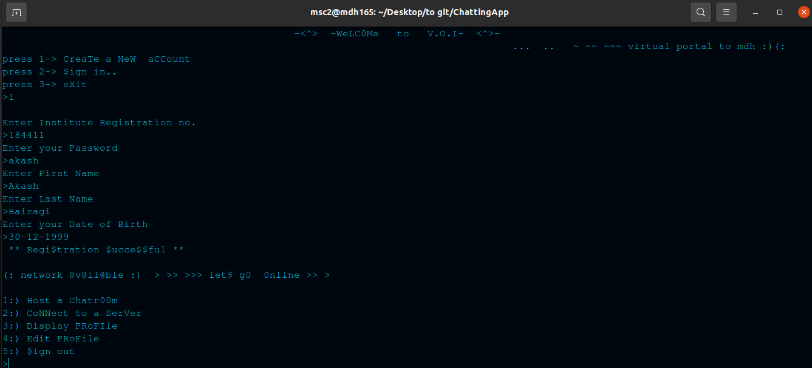
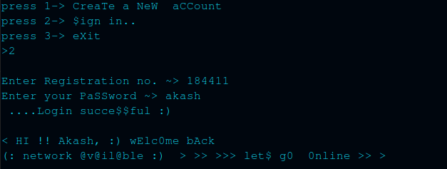
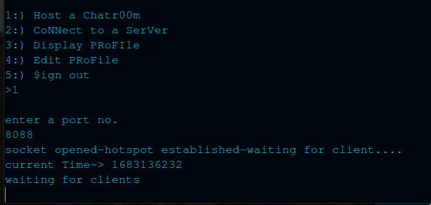
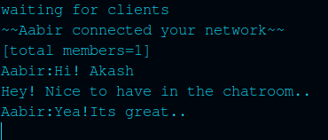
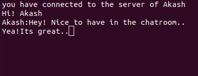

# Chat-Room
An application to host chatrooms in LAN.

Fetures of the project:
* Object oriented programming
* P-threads
* Socket Programming

#### Working:

* Registration  
  

  
  
* Login  
  

  
  
* Hosting a Server  
  

  
  
* New User entering the chatroom  
  

  
  
* Conversations
  
 

